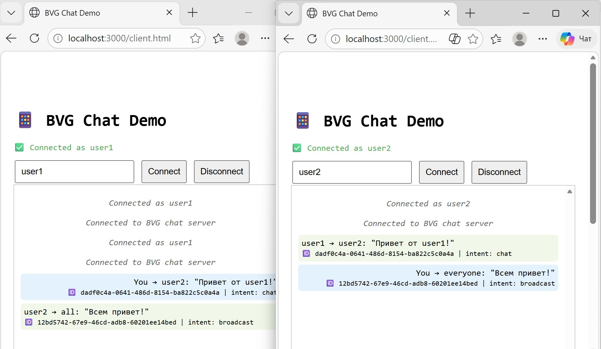

# bridge-messenger-sdk

Open-source SDK for integrating BRIDGE (BVG) into messengers.

## Структура

- client/ — готовые модули для Android, iOS, Web
- server/ — примеры серверной обработки (Go/Python)
- examples/ — сквозные демо (чат, синхронизация)

## Лицензия

MIT — используйте как хотите.

## Контакты

Хушвахт Раупов — [telegram]
## 🚀 Quick start

```bash
git clone https://github.com/Khushvakht799/bridge-messenger-sdk
cd bridge-messenger-sdk/examples/chat-demo
npm install
npm start
# Open http://localhost:3000/client.html

## 🖥 Демо-чат в действии




## 📢 Telegram-канал

Подписывайтесь на новости и обновления BRIDGE: [t.me/bridge_tech](https://t.me/bridge_tech)

